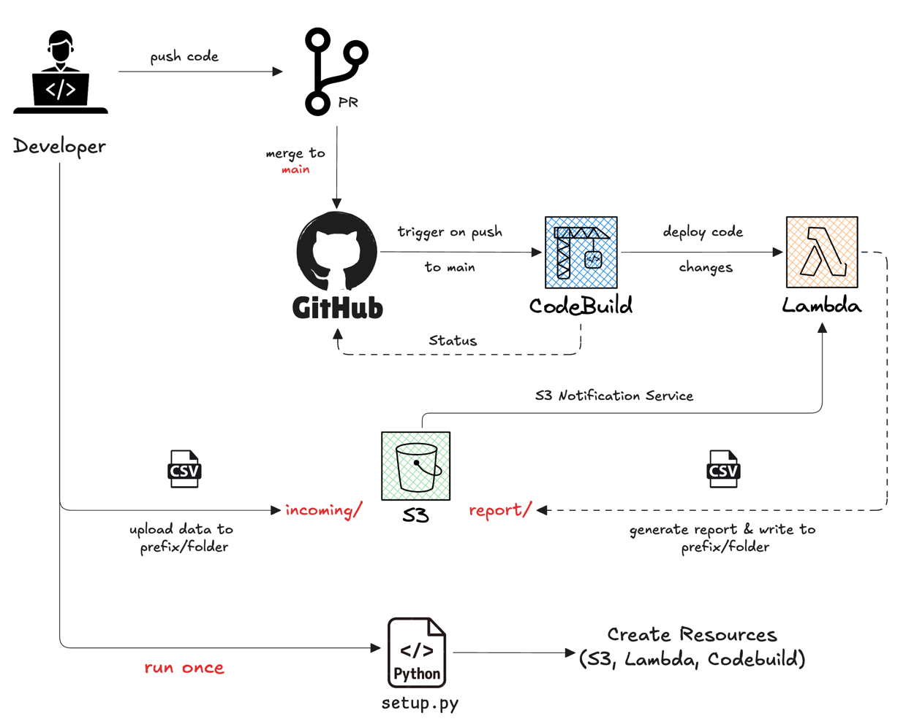
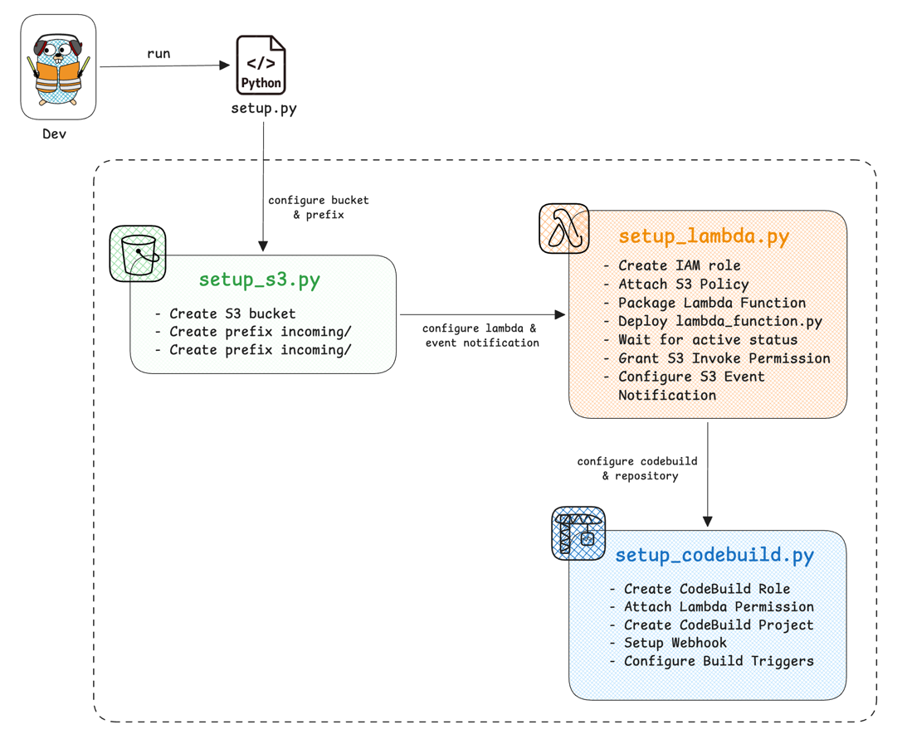

# Order Report Automation

A serverless pipeline that processes order CSV files uploaded to S3 and generates city-wise revenue summaries. 
Uploading a file to the S3 landing prefix triggers a Lambda function that aggregates revenue by city and 
writes a summary report back to S3. Code changes pushed to main are automatically built and deployed via 
AWS CodeBuild.

## Prerequisites

- Python 3.14+
- uv
- AWS credentials configured locally
- AWS CLI installed

## Architecture

### High Level Overview

---
### Project Resources Initialization

---
## Quick Start

### 1. Clone and Setup

```bash
git clone https://github.com/L00kAhead/order-report-automation.git
cd order-report-automation
```

### 2. Install Dependencies

```bash
uv sync
```

### 3. Configure Environment Variables

Create a `.env` file in the project root with the following variables:

```env
BUCKET=<your_bucket_name>
LANDING_PREFIX=incoming
REPORTING_PREFIX=reports
AWS_REGION=us-east-1

LAMBDA_FUNCTION_NAME=<your_func_name>
LAMBDA_ROLE=<your_lambda_role>
LAMBDA_TIMEOUT=60
LAMBDA_MEMORY=256
LAMBDA_EPHEMERAL_SIZE=512


CODE_BUILD_PROJECT_NAME=<your_codebuild_project_name>
CODE_BUILD_SOURCE=GITHUB
CODE_BUILD_REPO_URL=<repo_url>
CODE_BUILD_ENVIRONMENT=ARM_LAMBDA_CONTAINER
CODE_BUILD_COMPUTE_TYPE=BUILD_LAMBDA_1GB
CODE_BUILD_IMAGE=aws/codebuild/amazonlinux-aarch64-lambda-standard:python3.14
CODE_BUILD_ROLE_NAME=<your_codebuild_role_name>
```

### 4. Deploy Infrastructure

Run the master setup script to create all AWS resources:

```bash
python setup.py
```

This will:
- Create S3 bucket and prefixes
- Set up Lambda execution role and function
- Configure CodeBuild project for CI/CD

## Input Format

Order CSV files should be placed in the S3 landing prefix with the following format:
**Note:** File should be named as `orders_YYYY-MM-DD.csv` (e.g., `orders_2026-03-01.csv`)

```csv
order_id,customer_name,product,category,quantity,price,city,order_date
ORD0051,Aarav Sharma,Notebook,Stationery,5,99.0,Chennai,2026-03-02
ORD0052,Aditya Singh,Pen Pack,Stationery,2,199.0,Chennai,2026-03-02
```

**Expected columns:**
- `order_id`: Unique order identifier
- `customer_name`: Name of the customer
- `product`: Product name
- `category`: Product category
- `quantity`: Order quantity
- `price`: Unit price
- `city`: City where order was placed
- `order_date`: Date of order

## Output Format

The Lambda function generates revenue summary reports in the S3 reporting prefix:

```csv
city,total_revenue
Chennai,2980.00
Delhi,3597.00
Mumbai,495.00
Bangalore,1193.00
```

Output files are named with the pattern: `city_revenue_summary_YYYY-MM-DD.csv`## Testing

## Test 
To test with sample data:

1. Upload `test_data/orders_2026-03-02.csv` to your S3 landing bucket.
   **Copy file to s3 bucket:**
   
   ```bash
   aws s3 cp data/test_data/orders_2026-03-01.csv s3://<bucket_name>/incoming/
   ```

2. Lambda will automatically trigger and process the file
3. Check the report prefix for the generated summary

## Project Structure

```
order-report-automation/
├── data
│  ├── output
│  │  └── city_revenue_summary_2026-03-02.csv
│  └── test_data
│      └── orders_2026-03-02.csv
├── diagrams
│  ├── architecture.png
│  └── project_infra.png
├── screenshots
│  ├── cloudwath_logs.png
│  ├── codebuild.png
│  ├── generated_report.png
│  └── s3bucket.png
├── src
│  ├── __init__.py
│  ├── lambda_function.py
│  ├── policies
│  │  ├── code_build_execution_policy.json
│  │  ├── codebuild_trust_policy.json
│  │  ├── lambda_execution_policy.json
│  │  └── lambda_trust_policy.json
│  ├── scripts
│  │  ├── __init__.py
│  │  ├── setup_codebuild.py
│  │  ├── setup_lambda.py
│  │  └── setup_s3.py
│  └── utils
│      ├── __initi__.py
│      ├── configs.py
│      └── helper_functions.py
├── pyproject.toml
├── setup.py
├── README.md
├── buildspec.yml
└── uv.lock
```

## Core Components

### Lambda Function (`src/lambda_function.py`)

The main Lambda handler processes S3 events:

- **`lambda_handler(event, context)`**: Entry point triggered by S3 events
- **`_load_file_from_s3(bucket_name, key)`**: Reads order CSV from S3
- **`_aggregate_revenue_by_city(csv_file)`**: Aggregates revenue by city
- **`_upload_summary(aggregate_data, bucket_name, output_key)`**: Uploads report to S3
- **`_execute_pipeline(bucket, key, output_key)`**: Orchestrates the pipeline

### Configuration (`src/utils/configs.py`)

Loads all configuration from environment variables. Supports:
- S3 bucket and prefix configuration
- Lambda function settings
- CodeBuild project settings
- AWS region selection

### Setup Scripts

- **`setup_s3.py`**: Creates S3 bucket and prefixes
- **`setup_lambda.py`**: Creates IAM role, deploys Lambda function, and sets up S3 event notifications
- **`setup_codebuild.py`**: Sets up CodeBuild project for continuous deployment

## Deployment & CI/CD

The project uses AWS CodeBuild for continuous deployment:

1. **Build Process** (`buildspec.yml`):
   - Validates Python version and AWS CLI
   - Creates Lambda deployment package
   - Updates Lambda function code

2. **Deployment**:
   - CodeBuild watches the repository
   - On commit (main), automatically builds and deploys updates

---

